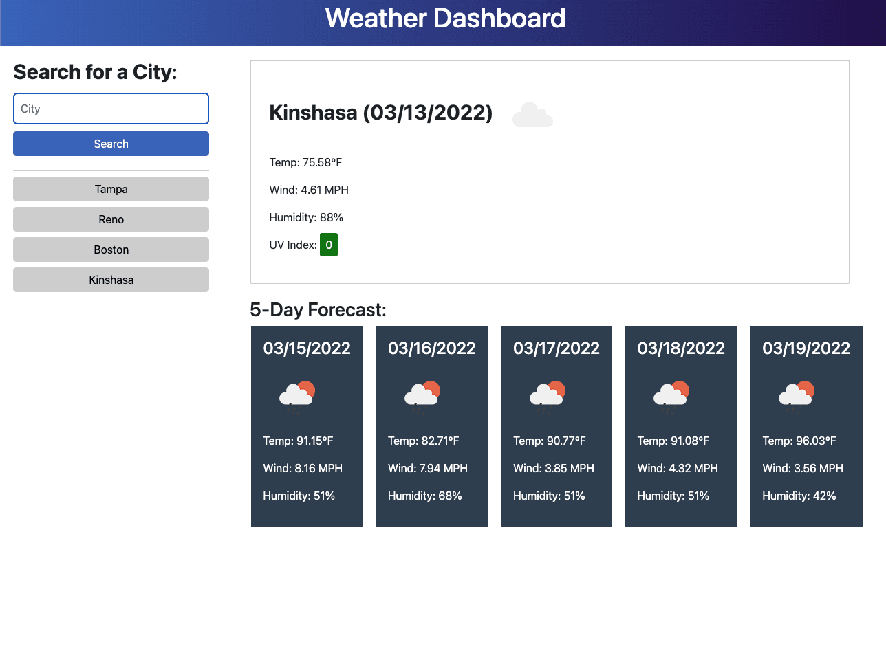

# Storm_Frontend

This application draws on data made available through the OpenWeather One Call API. Users can input a city and be presented with both the current weather in that city and the forecast for the next 5 days. User searches are saved in local storage and displayed as buttons that link to the weather at those locations. Weather is represented as temperature, humidity, wind speed, color-coded UV index, as well as an iconic representation of the overall conditions.

## User Story
```
AS A traveler
I WANT to see the weather outlook for multiple cities
SO THAT I can plan a trip accordingly
```

## Acceptance Criteria
```
GIVEN a weather dashboard with form inputs
WHEN I search for a city
THEN I am presented with current and future conditions for that city and that city is added to the search history
WHEN I view current weather conditions for that city
THEN I am presented with the city name, the date, an icon representation of weather conditions, the temperature, the humidity, the wind speed, and the UV index
WHEN I view the UV index
THEN I am presented with a color that indicates whether the conditions are favorable, moderate, or severe
WHEN I view future weather conditions for that city
THEN I am presented with a 5-day forecast that displays the date, an icon representation of weather conditions, the temperature, the wind speed, and the humidity
WHEN I click on a city in the search history
THEN I am again presented with current and future conditions for that city
```

## Screenshot



## Deployed Application Can Be Found At:

https://cahillmichael.github.io/Storm_Frontend/